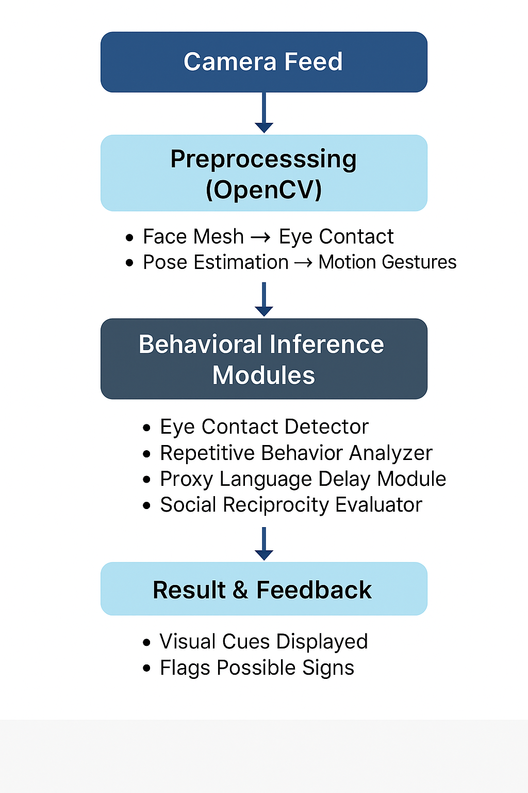

# 🧩 ASD Vision: Computer Vision for Autism Screening


<div align="center">
  
  <h3>AI-Powered Early Signs Detection for Autism Spectrum Disorder</h3>
</div>

## 📋 Overview

**ASD Vision** is an innovative computer vision application designed to help identify possible early behavioral signs associated with Autism Spectrum Disorder (ASD). Using only a standard webcam, the system analyzes several key behavioral markers that may indicate the need for professional evaluation:

- 👁️ **Eye Contact Detection** - Measures sustained eye contact duration
- 🔄 **Repetitive Behavior Analysis** - Identifies repetitive movement patterns
- 🗣️ **Language Development Proxy** - Assesses response to name/gestures
- 🤝 **Social Reciprocity Evaluation** - Measures social engagement indicators

> ⚠️ **IMPORTANT DISCLAIMER**: This tool is NOT a diagnostic instrument. It is designed as a screening aid only and should never replace professional medical evaluation. Always consult healthcare professionals for proper diagnosis and treatment.

## 🔍 How It Works

The system follows a streamlined workflow for behavioral analysis:



1. **Camera Feed** captures real-time video using a standard webcam
2. **Preprocessing** with OpenCV prepares frames for analysis
3. **MediaPipe Models** extract face and body landmarks
4. **Behavioral Analysis Modules** process the landmarks to detect specific patterns
5. **Visualization & Feedback** presents results in real-time with visual indicators

## ✨ Features

### 👁️ Eye Contact Detection
```python
# eye_contact_detection.ipynb
```
- Tracks facial orientation and eye position using MediaPipe Face Mesh
- Measures duration and frequency of eye contact
- Provides real-time visual feedback on detected eye contact

### 🔄 Repetitive Behavior Analysis
```python
# repetitive_behavior.py
```
- Identifies repetitive motor movements using pose estimation
- Tracks frequency and duration of repetitive patterns
- Visualizes detection with on-screen indicators

### 🗣️ Language Development Proxy
```python
# language_delay_proxy.ipynb
```
- Simulates a "name call" stimulus using visual cues
- Measures response time to social prompts
- Flags potential language development concerns based on response patterns

### 🤝 Social Reciprocity Evaluation
```python
# social_reciprocity_detection.ipynb
```
- Analyzes joint attention behaviors
- Detects social engagement indicators through physical response
- Evaluates reciprocal interaction patterns

## 🛠️ Technical Architecture

Each module operates independently but follows a shared architecture:

1. **Video Capture** - Frames captured through OpenCV's VideoCapture
2. **Landmark Detection** - MediaPipe models extract precise facial/body keypoints
3. **Behavioral Analysis** - Custom algorithms process landmark data
4. **Visual Feedback** - Real-time annotations display analysis results

## 💻 Technology Stack

- **Python** - Core programming language
- **OpenCV** - Computer vision operations and video processing
- **MediaPipe** - Face mesh and pose estimation models
- **NumPy** - Efficient numerical operations
- **Jupyter Notebooks** - Interactive development environment

## 🚀 Setup & Installation

### Prerequisites
- Python 3.10+
- Webcam

### Installation

1. Clone the repository
   ```bash
   git clone https://github.com/mdnm18/asd-vision.git
   cd asd-vision
   ```

2. Create and activate virtual environment
   ```bash
   python -m venv venv
   source venv/bin/activate  # On Windows: venv\Scripts\activate
   ```

3. Install dependencies
   ```bash
   pip install -r requirements.txt
   ```

### Running the Modules

#### Eye Contact Detection
```bash
jupyter notebook notebooks/eye_contact_detection.ipynb
```

#### Repetitive Behavior Analysis
```bash
python scripts/repetitive_behavior.py
```

#### Language Delay Proxy
```bash
jupyter notebook notebooks/language_delay_proxy.ipynb
```

#### Social Reciprocity Detection
```bash
jupyter notebook notebooks/social_reciprocity_detection.ipynb
```

## 📂 Project Structure

```
asd-vision/
├── notebooks/
│   ├── eye_contact_detection.ipynb      # Eye contact measurement
│   ├── language_delay_proxy.ipynb       # Language development assessment
│   └── social_reciprocity_detection.ipynb  # Social engagement analysis
├── scripts/
│   └── repetitive_behavior.py           # Repetitive movement detection
├── assets/
│   └── workflow.png                     # System workflow diagram
├── requirements.txt                     # Project dependencies
└── README.md                            # Project documentation
```

## 👤 Author

**MD NAYAJ MONDAL**
- GitHub: [mdnm18](https://github.com/mdnm18)
- LinkedIn: [MD NAYAJ MONDAL](https://www.linkedin.com/in/md-nayaj-mondal)
- Twitter: [@MD_N_M_18](https://x.com/MD_N_M_18)

## 💡 Future Scope

- 📱 **Mobile Application** - Port the system to mobile platforms for wider accessibility
- 🧠 **Machine Learning Integration** - Train models on collected data for improved accuracy
- 🔊 **Audio Analysis** - Add speech pattern detection for comprehensive assessment
- 📊 **Longitudinal Tracking** - Implement progress monitoring over time
- 🌐 **Web Dashboard** - Create a secure portal for reviewing recorded sessions
- 👨‍👩‍👧‍👦 **Multi-person Tracking** - Enable analysis of child-parent interactions

## 📚 References

1. American Academy of Pediatrics. (2020). Identification, Evaluation, and Management of Children With Autism Spectrum Disorder. Pediatrics, 145(1).
2. Daniels, A. M., & Mandell, D. S. (2014). Explaining differences in age at autism spectrum disorder diagnosis: A critical review. Autism, 18(5), 583-597.
3. MediaPipe documentation: https://google.github.io/mediapipe/
4. OpenCV documentation: https://docs.opencv.org/

## 📄 License

This project is licensed under the MIT License - see the [LICENSE](LICENSE) file for details.
